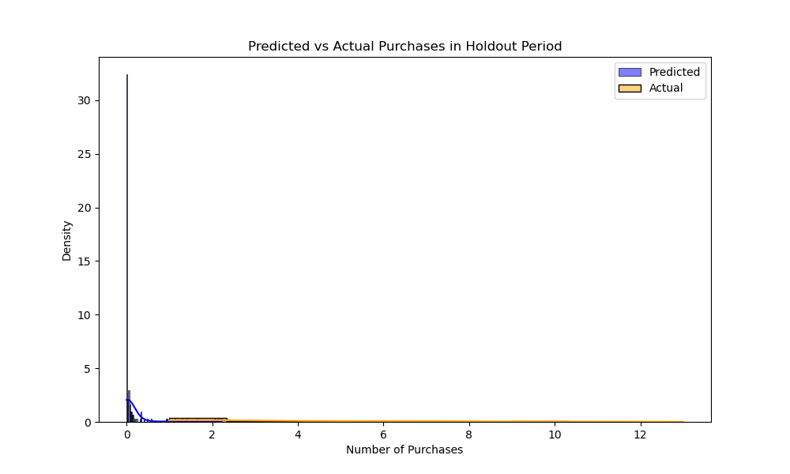
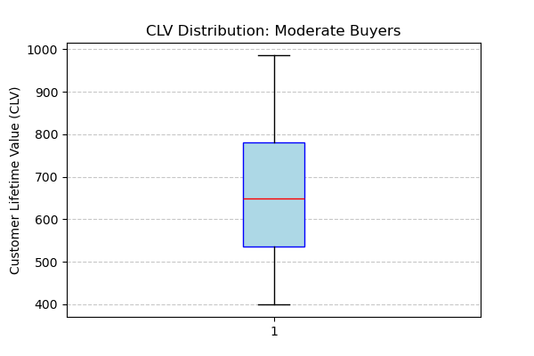
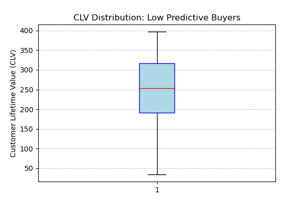

# Customer Lifetime Value Analysis with BG/NBD Model

This project focuses on **predicting customer purchasing behavior** and estimating **Customer Lifetime Value (CLV)** using the **BG/NBD model**. The analysis includes **exploratory data analysis (EDA)**, **model training**, **Monte Carlo simulations**, and **segmentation insights**.

---

## 1. Exploratory Data Analysis (EDA)

To understand customer purchasing patterns, we performed an initial exploratory data analysis using **Recency, Frequency, and Monetary (RFM)** metrics.

- **RFM Distributions:**
  

- **RFM Distributions (Calibration vs Holdout):**
  

These plots validate that our **calibration** and **holdout** datasets have similar characteristics, ensuring reliable model training and evaluation. We observe that **most customers exhibit low purchasing frequency**, which is typical for **non-contractual customers**. This aligns with real-world scenarios where customer engagement is sporadic and hard to predict.

---

## 2. BG/NBD Model Training & Evaluation

The **BG/NBD model** was trained on the **calibration dataset** and evaluated against the **holdout set** to predict customer purchase frequencies.

- **Predicted vs Actual Purchases:**
  

This comparison illustrates how well the model captures customer purchasing behavior. However, it's important to recognize that the **BG/NBD model is a simplification** of real-world dynamics. While it assumes certain statistical regularities, customer behavior can be influenced by external factors like promotions, seasonality, and market changes, which aren't fully accounted for here.

Despite these limitations, the model serves as a **solid starting point**. It allows us to **match model predictions with business intuition** and engage stakeholders in discussions about customer behavior, ultimately driving improvements and refinements.

---

## 3. Monte Carlo Simulations

Using the trained BG/NBD model, we ran **Monte Carlo simulations** to forecast purchases over the next **180 days**.

- **Daily Purchase Trends Over 180 Days:**
  

- **Cumulative Purchase Trends Over 180 Days:**
  

The simulations reveal that **most customers are unlikely to make frequent purchases** within the forecast period. This is expected for non-contractual customers, where **sporadic engagement** is the norm. These insights reinforce the idea that while the model simplifies behavior, it provides a **valuable baseline** for iterative improvements.

---

## 4. Customer Segmentation & CLV Analysis

Based on the **predicted future purchases** and **monetary value**, we calculated the **Customer Lifetime Value (CLV)** and segmented customers into:

1. **High-Value Customers**
2. **Moderate Buyers**
3. **Low Predictive Buyers**

- **Customer Segments Distribution:**
  

The segmentation shows that **only a small percentage of customers fall into the High-Value category**, while the majority are low-frequency buyers. This distribution is consistent with typical **Pareto principles** in customer behavior, where a small fraction of customers generate the most revenue.

### CLV Distribution by Segment

To better understand the variation in CLV across different customer segments, we visualized the CLV distributions.

- **High-Value Customers CLV Distribution:**
  

- **Moderate Buyers CLV Distribution:**
  

- **Low Predictive Buyers CLV Distribution:**
  

These plots highlight the **significant variability in CLV**, especially among high-value customers. While the model simplifies customer behavior, these visualizations offer actionable insights for **targeted marketing** and **customer retention strategies**.

---

## Conclusion

This analysis demonstrates the power of **probabilistic models** and **simulations** in predicting customer behavior and estimating CLV. While the **BG/NBD model** is an oversimplification of real-world dynamics, it serves as a **valuable starting point**. By aligning the model's predictions with **business intuition** and engaging stakeholders, we can iteratively refine the analysis to better understand customer behavior and drive business growth.

**Key Takeaways:**
- **Most non-contractual customers exhibit sporadic purchasing behavior**, which the model captures effectively.
- While the model doesn't account for all real-world complexities (e.g., promotions, seasonality), it provides a **baseline** for more nuanced analyses.
- This framework facilitates **collaboration with business leaders** to refine predictions, tailor marketing strategies, and optimize customer engagement.

**Changes Made to Enhance Purchase Variability**

To address the overly smooth and unrealistic purchase trends observed earlier, we made the following key adjustments to the **Monte Carlo simulation** and **visualization process**:

1. **Introduced Random Variability in Purchase Rates:**
   - Added a **Beta distribution** (`np.random.beta(a=2, b=5)`) to **scale the Poisson rate (`lambda`)** for daily purchases.
   - This introduces more **randomness** and allows for **sporadic bursts** of purchases, reflecting real-world non-contractual customer behavior.

2. **Adjusted Poisson Distribution Parameters:**
   - The **Poisson process** was modified to include **dynamic scaling** of purchase probabilities, increasing day-to-day variability.
   - This ensures that customers don't follow a rigid purchase schedule, introducing **natural fluctuations**.

3. **Simulated Individual Daily Purchase Events:**
   - Instead of distributing expected purchases evenly across days, we simulated **specific purchase events** on random days.
   - This shift from **averaged** behavior to **event-based** simulations resulted in more **realistic purchase patterns**.

---

### **Impact of Changes on the Graphs:**

1. **Daily Purchase Trends:**
   - The graph now shows **natural fluctuations** in daily purchases, with **periods of low activity** and **occasional spikes**.
   - This mirrors real-world purchasing patterns where customers are **inconsistent** in their buying behavior.

2. **Cumulative Purchase Trends:**
   - While the cumulative trend still shows an overall increase, the underlying data now reflects **uneven growth** due to variability in daily activity.
   - The **linear appearance** is expected over a large number of simulations but is now driven by **variable daily events** rather than uniform growth.

---

#### These adjustments ensure the model better reflects **realistic customer behavior**, providing more actionable insights for business applications and aligning more closely with **stakeholder expectations**.
---
